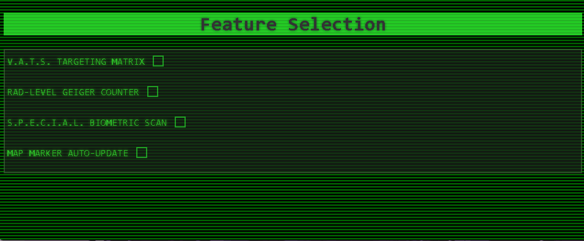

# Feature Selection(pip-boy Fallout style)

An interactive, retro-futuristic terminal interface inspired by the iconic **Pip-Boy** from the *Fallout* universe. This responsive web page allows users to toggle tactical and biometric features using customized utility controls.

Built as part of the **freeCodeCamp Responsive Web Design Certification**.

## 🚀 Live Demo
 [Live demo click here](https://JosueVasquez2305.github.io/Feature-Selection-Page-FCC/)

## 📸 Preview

## 🛠️ Tech Stack & Features
- **Semantic HTML5:** Structuring clean component layouts for technical forms.
- **CSS3 Retro-Styling:** - CRT screen simulation using a `repeating-linear-gradient` for authentic scanlines.
  - Multi-layered green phosphor palette utilizing `rgba()` opacity filters for natural back-lighting interaction.
  - Custom styled interactive checkboxes with dynamic glow transitions (`text-shadow`).
- **Typography:** Pixel-perfect monospace display using `'Share Tech Mono'`.

## 💡 Technical Challenges & Solutions
### 1. Custom Checkbox & Text Alignment
- **Problem:** Re-skinning standard checkboxes with `appearance: none` often disrupts the natural text baseline, causing the interactive box to sit lower than the label text.
- **Solution:** Swapped rigid layout properties for `vertical-align: middle` paired with an explicit `display: inline-block` on the input, finishing with a precise `top: -2px` relative offset to achieve pristine optical alignment.

### 2. Phantom Hover Areas in Block Layouts
- **Problem:** Setting the `<label>` elements to `display: block` forced the clickable zones to stretch $100\%$ across the screen container, triggering accidental hover states in completely empty areas.
- **Solution:** Optimized the layout footprint by switching to `display: table`. This unique formatting context maintains the vertical stacking flow of standard block components while forcing the element's width to strictly hug its internal text and input nodes.

## ✒️ Author
- GitHub - [@JosueVasquez2305](https://github.com/JosueVasquez2305)
- freeCodeCamp - [@fcc-josuevasquez](https://www.freecodecamp.org/fcc-josuevasquez)